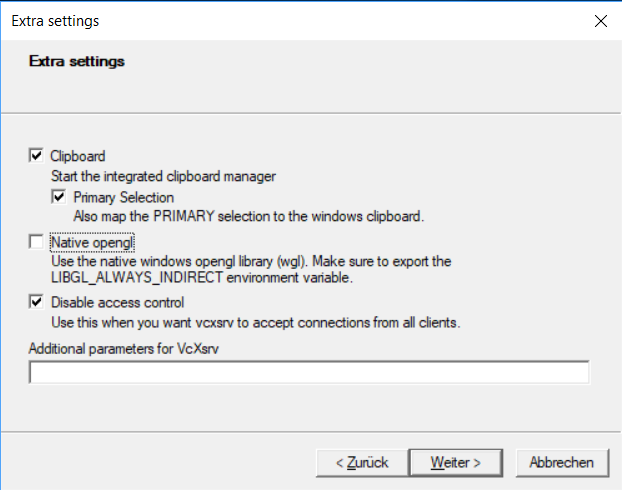

# Instructions for Docker 

The following readme gives a short introduction on how to use the docker container on Linux and on Windows.   
Note that it is not possible to communicate with other hosts (e.g. Turtlebot) via wifi nor lan if you use docker on Windows.

## Prequisites

1. Install docker (here are the instructions: [Ubuntu](https://docs.docker.com/install/linux/docker-ce/ubuntu/) [Windows](https://docs.docker.com/docker-for-windows/install/) )
2. Copy the downloaded files of this repository to a destination of your choice. e.g. ~/Documents/TW-Robotics/ROS1

### Windows only

3. Install VcXsrv as X11-Server: [link](https://sourceforge.net/projects/vcxsrv/files/latest/download)   
    Make sure that you allow VcXsrv access to public and private networks

## Startup the Docker Container

### Via VS Code Dev Container (Recommended if you are not familiar with the terminal)
1. [Install Visual Studio Code](https://code.visualstudio.com/)
2. Install the Remote Development Extension Pack
3. Download this repository to a destination of your choice. e.g. ~/Documents/TW-Robotics/ROS1
4. Open the folder in Visual Studio Code
5. Open the command palette (Ctrl+Shift+P) and type `Dev Containers: Rebuild and Reopen in Container`


### Via the terminal (Recommended if you are familiar with the terminal)
To ease the start of the docker container we provide a script that starts the container with the correct settings.   
See the [Linux](#linux) or [Windows](#windows) section for further instructions.

#### Linux

1. To start the docker container execute the following command in the terminal (this will download the docker container and start it):

   ```shell
   bash run_docker_from_hub.sh
   ```

#### Windows

1. Start VcXsrv (XLaunch) with following configuration:   

2. To start the docker container double klick on [run_docker_from_hub.bat](./run_docker_from_hub.bat)  (this will download the docker container and start it):   
    On the first start docker will ask for permissions to mount catkin_ws/src folder (for more see below).

## Development inside the Docker Container

### Working with the terminal
To work with multiple terminals inside docker we recommend using [tmux]() which is set as the default shell.   
See the following links on how to use tmux: 
* [a quick and easy guide to tmux](https://www.hamvocke.com/blog/a-quick-and-easy-guide-to-tmux/)
* [a tmux crash course](https://thoughtbot.com/blog/a-tmux-crash-course)
* [tmux cheat sheet](https://tmuxcheatsheet.com/) 


### Recommended IDE
If you want to work with a IDE we recommand to use [Visual Studio Code](https://code.visualstudio.com/) and the following plugins:

- [Remote Development](https://code.visualstudio.com/docs/remote/remote-overview)

#### Setup Visual Studio Code

1. Install Visual Studio Code
2. Install the Remote Development Extension Pack
3. [Start the docker container](#startup-the-docker-container)
4. Use the remote development extension to connect to the docker container.
5. In the VS Code that is attached to the docker container:
   1. Open the command palette (Ctrl+Shift+P) and type `Dev Containers: Open Container Configuration File`
   2. Paste the content of the file [devcontainer.json](./.devcontainer/devcontainer.json) into the file that was opened.
6. Restart the VS Code and you are ready to go.

<br/>
<br/>

__Attention:__ Docker containers are not persistent. This means that all changes made to the container are lost after the container is stopped. 
    To ease with the development the folder `./catkin_ws/src/` is mounted into the docker container at the location `$HOME/caktin_ws/src/fhtw`. This allows you to save your projects on your host computer and execute them in the docker container.

__Attention:__ Windows users are required to give docker permission to mount the folder `./catkin_ws/src/` into the container. This is done by clicking on the "Share it" button in the docker settings.

__Attention:__ Windows users are advised to only work inside the docker container when modifying files or set the line endings of the files to LF. For more see the settings of your 
